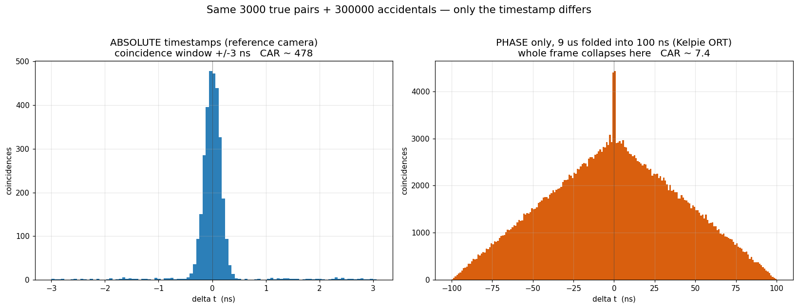

# Why the Kelpie ORT coincidence background is a triangle

**TL;DR** — The Kelpie ORT timestamp records only *where in a 100 ns oscillator
cycle* a photon arrived, not *which* cycle inside the ~9 µs frame. That single
fact — **losing the absolute timestamp and keeping only the phase** — turns the
flat accidental background of a normal time‑tagger into a **triangle**, and
concentrates the accidentals under the peak by a factor **T_frame / T_phase ≈
9 µs / 100 ns ≈ 90**. It is not an analysis bug; it is a direct consequence of
folding 9 µs into 100 ns.

---

## 1. Two ways to timestamp the same photon

Consider a photon that arrives at absolute time `t` inside one acquisition
frame of length `T = 9 µs`. The ring oscillator has period `P = 100 ns`, so we
can write

```
t = k·P + φ ,     k = 0,1,…,89   (which 100 ns cycle),   φ ∈ [0, P)  (phase in the cycle)
```

* **Reference camera (absolute tagger).** Stores the full `t` (100 ps
  resolution over the whole frame). Both `k` and `φ` are kept.
* **Kelpie ORT.** Stores **only `φ`** — the phase within the current 100 ns
  cycle — and only **one value per pixel per frame**. The cycle index `k` is
  thrown away.

Everything below follows from that one difference.

---

## 2. A coincidence is a *difference* of two timestamps

For a signal photon (pixel A) and an idler photon (pixel B) we histogram

```
Δ = t_B − t_A          (absolute tagger)
Δ = φ_B − φ_A          (Kelpie ORT: phases only)
```

* A **true SPDC pair** is *simultaneous*: `t_A = t_B` (to within the ~100 ps
  jitter). Then `Δ = 0` in **both** schemes — same cycle, same phase. **The peak
  at Δ = 0 survives the folding.** This is why you still see a peak.
* An **accidental** pair is two *independent* photons. Their `Δ` distribution is
  what changes shape — and that is the whole story.

---

## 3. The math: difference of two uniform times is a triangle

Photon arrival times within a frame are (to good approximation) **uniform**.
Two independent uniform variables, differenced, give a **triangular**
distribution — this is the autocorrelation of a boxcar:

If `X, Y ~ Uniform(0, L)` independently, then `D = Y − X` has density

```
        L − |D|
f(D) =  ───────── ,   |D| ≤ L ,   0 otherwise
          L²
```

a triangle peaking at `D = 0`, falling linearly to zero at `|D| = L`, with

```
peak density at 0 :  f(0) = 1 / L
```

### Absolute tagger → base L = T

Absolute times are uniform over the **whole frame**, `Uniform(0, T)`. So
accidentals form a triangle with base `±T = ±9 µs`:

```
f_abs(0) = 1 / T = 1 / 9000 ns   (accidentals per ns, per accidental pair)
```

Over a normal **±ns coincidence window**, that triangle is essentially flat and
almost empty — the background you expect. (Left panel of the figure.)

### Kelpie ORT → base L = P

Here is the key step. Taking a uniform time modulo the period,

```
φ = t mod P
```

maps `Uniform(0, T)` onto `Uniform(0, P)` **exactly** when `T` is a whole number
of periods (`9000 = 90 × 100`). Every one of the 90 cycles folds onto the same
`[0, 100 ns)` interval. So the phase is uniform on `[0, P)`, and the accidental
difference `φ_B − φ_A` is a triangle with base `±P = ±100 ns`:

```
f_phase(0) = 1 / P = 1 / 100 ns
```

---

## 4. The folding concentrates accidentals by T / P

Compare the accidental density **right under the peak** (at `Δ = 0`) in the two
schemes:

```
f_phase(0)     1/P      T       9 µs
──────────  =  ───   =  ─   =  ──────  =  90
 f_abs(0)      1/T      P      100 ns
```

**Folding 9 µs into 100 ns piles 90 frames' worth of accidental combinations on
top of each other at Δ = 0.** The number of true pairs at Δ = 0 is unchanged
(they were already at 0). So the coincidence‑to‑accidental ratio drops by the
same factor:

```
CAR_phase        P      100 ns      1
─────────   =    ─   =  ──────  =  ──── ≈ 0.011      →   ~90× worse contrast
 CAR_abs         T       9 µs        90
```

at the same singles rate, same resolution, same source.

### The same thing in the time domain: aliasing pulls random Δ toward zero

Write any pair's **true** separation as

```
Δ_true = t_B − t_A = (k_B − k_A)·P  +  (φ_B − φ_A)
                     └── global cycle ──┘   └ what ORT keeps ┘
```

ORT records only the second term, `Δ_rec = φ_B − φ_A`, so

```
Δ_rec = Δ_true − (k_B − k_A)·P
```

The discarded `(k_B − k_A)·P` — the **global cycle offset** — *is* the
absolute‑time information. Dropping it means:

* **Random pairs are recorded with a shorter `|Δ|` than they truly have.** A
  random pair genuinely 3.5 µs apart (`k_B − k_A = 35`) is stored at
  `Δ_rec = φ_B − φ_A ∈ (−100, +100) ns` — it masquerades as a near‑coincidence.
* **And they cluster at zero, not spread flat.** Because the two phases are each
  uniform, `Δ_rec` is *triangular* — the aliasing preferentially yields *small*
  apparent separations, piling the fake near‑coincidences **right under the true
  peak** (density at 0 is 2× a flat spread of the same counts).

This is the physical content of the `T/P` concentration above: the long real
delta‑ts of random pairs — which on an absolute tagger form the flat,
out‑of‑the‑way background — are folded back onto `Δ ≈ 0`. True pairs already sit
at `Δ = 0`, so **only the background moves onto the peak**. The lost cycle
information does not just reduce contrast uniformly; it dumps the accidentals
exactly where they do the most damage.

---

## 5. Demonstration (same photons, two timestamps)



Both panels use the **identical** 3000 simultaneous pairs and 300 000
accidental pairs. Only the timestamp differs.

* **Left — absolute timestamps:** accidentals spread over ±9 µs, so in a ±3 ns
  window the background is flat and nearly empty; the peak dominates
  (CAR ≈ 480). This is your reference camera.
* **Right — phase only (9 µs folded into 100 ns):** every accidental collapses
  into the ±100 ns triangle; the peak is a thin spike on a large triangular
  pedestal (CAR ≈ 7). This is Kelpie ORT.

The real 2026‑07‑24 SPDC data reproduces the right panel exactly: a clean
triangle from −100 ns to +100 ns with a sharp spike at 0.

---

## 6. Why this is *not* fixable in the analysis

The information that would flatten the background — the cycle index `k`, i.e. the
absolute time within the frame — **was never recorded**. Verified against the
MATLAB reference decoder (`kelpie_data_ddr3.m`): the timestamp field is only a
10‑bit coarse + 4‑bit fine value that wraps at ~1300 codes (~100 ns), with no
counter for `k`. You cannot un‑fold a triangle back into a flat background
without `k`.

Two things also make it worse in practice:

* **One timestamp per pixel per frame** (first photon only): at high occupancy
  the true pair's photon is often *preempted* by an earlier uncorrelated photon,
  suppressing the peak on top of the concentrated background.
* **Larger frames make it worse**: the factor is `T/P`, so a longer `T`
  (the DCR‑consistency check hints `T` may be ~40 µs, not 9 µs) means an even
  bigger triangle.

## 7. What restores it

Only recovering absolute time, or shrinking the fold:

| Lever | Effect on `T/P` | Notes |
|---|---|---|
| **Absolute / start‑stop timestamp mode** | removes the fold entirely | needs firmware/HW support (a "stopped" TDC vs the free‑running one); memory notes a run failing because *"the TDC never stopped"*, implying such a mode exists |
| **Shorter frame `T`** | linear improvement | `T = 900 ns` → 10× better CAR |
| Better focusing / more statistics | **no change to CAR** | improves count *rate* and significance, not contrast — still worth doing, just not a fix for the triangle |

## 8. Separate issue: peak *width*

The triangle explains the background **shape** and the **contrast**, but not the
peak **width** (~500 ps measured vs ~100 ps expected). That is a timing‑
resolution question — code→time calibration (the flat 77 ps/code is only an
average; the density‑test LUT gives per‑code widths) and detector jitter — and
is independent of everything in this document.
